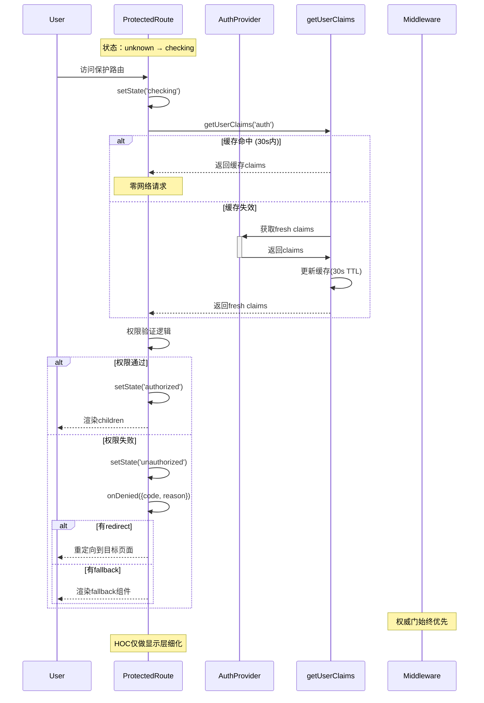

# Dev-Step 4.2 设计规范文档
# ProtectedRoute HOC 架构设计与接口规范

**设计日期**: 2025-09-04  
**架构师指令**: QAD-Research 阶段 - 严禁编码实现  
**EUD证据锚点**: 设计文档、状态机图、序列图、测试矩阵  

---

## 1. 接口规范 - ProtectedRouteProps 最终版

### 1.1 核心接口定义

```typescript
/**
 * ProtectedRoute HOC Props - 4.2 最终版接口
 * 架构师要求：数组归一化 + 结构化返回 + 枚举错误码
 * 
 * @types_source UserRole/UserClaims来自@/lib/supabase/client权威定义，保持单一事实源
 * @client_component 必须为客户端组件，禁止在Server Components中直接使用
 */
export interface ProtectedRouteProps {
  children: React.ReactNode
  
  // 角色要求 - 内部归一化为数组处理
  requiredRole?: UserRole | UserRole[]
  
  // 验证要求
  requireVerified?: boolean
  requireMFA?: boolean
  
  // 拒绝处理器 - 结构化返回，受安全约束限制
  onDenied?: (denial: DenialContext) => DenialResponse | void
  
  // 重定向配置
  redirectTo?: string
  fallback?: React.ReactNode
  
  // 返回URL保存 - 仅允许同源相对路径
  preserveReturnTo?: boolean
  
  // 开发调试 - 默认false，生产构建时去除
  debugMode?: boolean
}

/**
 * 拒绝上下文信息
 */
export interface DenialContext {
  code: DenialCode
  reason: string
  userClaims: UserClaims | null
  requestedPath: string
  timestamp: number
}

/**
 * 拒绝响应处理
 * @security_constraints action==='custom'受限于不得弱化middleware裁决
 * @redirect_security redirectTo必须经受信白名单/同源校验与安全编码防护
 */
export interface DenialResponse {
  action: 'redirect' | 'fallback' | 'custom'
  redirectTo?: string  // 必须经过安全校验，仅允许同源相对路径
  fallback?: React.ReactNode
  preventDefault?: boolean
}

/**
 * 架构师要求枚举错误码 - 单一拒绝码输出规则
 * @failure_priority 多条件同时失败时的唯一判定顺序（优先级递减）：
 * 1. NOT_AUTHENTICATED - 未认证用户优先处理
 * 2. MFA_REQUIRED - 已认证但MFA不足
 * 3. NOT_VERIFIED - 已认证但未验证专业身份
 * 4. ROLE_MISMATCH - 已认证已验证但角色不匹配
 */
export enum DenialCode {
  NOT_AUTHENTICATED = 'NOT_AUTHENTICATED',  // 优先级1 - 未认证
  MFA_REQUIRED = 'MFA_REQUIRED',           // 优先级2 - MFA不足
  NOT_VERIFIED = 'NOT_VERIFIED',           // 优先级3 - 未验证
  ROLE_MISMATCH = 'ROLE_MISMATCH'          // 优先级4 - 角色不匹配
}
```

### 1.2 数组归一化处理策略

```typescript
/**
 * requiredRole 内部归一化逻辑
 * 输入: string | string[] 
 * 输出: string[] (内部统一数组处理)
 */
const normalizeRoles = (requiredRole?: UserRole | UserRole[]): UserRole[] => {
  if (!requiredRole) return []
  return Array.isArray(requiredRole) ? requiredRole : [requiredRole]
}

// 使用示例：
// requiredRole="admin" → ["admin"]
// requiredRole={["admin", "tcm_practitioner"]} → ["admin", "tcm_practitioner"]
```

### 1.3 失败优先级与单一拒绝码判定逻辑

```typescript
/**
 * 架构师要求：多条件同时失败时的单一DenialCode选择规则
 * 严格按优先级顺序判定，避免"多码并发"歧义
 */
const determineDenialCode = (
  isAuthenticated: boolean,
  userClaims: UserClaims | null,
  requiredRoles: UserRole[],
  requireVerified: boolean,
  requireMFA: boolean
): DenialCode => {
  // 优先级1：NOT_AUTHENTICATED - 未认证用户优先处理
  if (!isAuthenticated || !userClaims) {
    return DenialCode.NOT_AUTHENTICATED
  }
  
  // 优先级2：MFA_REQUIRED - 已认证但MFA不足
  if (requireMFA && userClaims.aal !== 'aal2') {
    return DenialCode.MFA_REQUIRED
  }
  
  // 优先级3：NOT_VERIFIED - 已认证但未验证专业身份
  if (requireVerified && userClaims.verification_status !== 'verified') {
    return DenialCode.NOT_VERIFIED
  }
  
  // 优先级4：ROLE_MISMATCH - 已认证已验证但角色不匹配
  if (requiredRoles.length > 0 && !requiredRoles.includes(userClaims.role)) {
    return DenialCode.ROLE_MISMATCH
  }
  
  // 所有条件满足时不应调用此函数
  throw new Error('Invalid state: all conditions passed but denial code requested')
}
```

### 1.4 SSR与RSC边界约束

```typescript
/**
 * 架构师要求：ProtectedRoute必须为客户端组件，禁止在Server Components中直接使用
 * 
 * @file_constraint 文件头必须包含'use client'指令
 * @usage_detection 实现时添加误用检测策略
 * @server_component_guard 在Server Components中使用时抛出明确错误
 */
'use client'  // 必需指令

// 运行时检测误用（开发环境）
if (process.env.NODE_ENV === 'development') {
  if (typeof window === 'undefined') {
    console.error('[ProtectedRoute] 🚫 不能在Server Components中使用ProtectedRoute')
    console.error('[ProtectedRoute] 💡 请在客户端组件或'use client'组件中使用')
  }
}
```

### 1.5 自定义拒绝处理安全约束

```typescript
/**
 * 架构师要求：自定义拒绝处理的合规束缚与安全校验清单
 */
interface CustomDenialSecurityConstraints {
  // 不得弱化middleware裁决
  middlewareComplianceRule: 'custom_action不得绕过middleware.ts的权威判决'
  
  // 重定向安全校验清单
  redirectSecurityChecklist: {
    sameOriginOnly: '仅允许同源相对路径，禁止外域重定向'
    pathValidation: '路径必须经过白名单验证或安全编码'
    openRedirectPrevention: '防护开放重定向攻击'
    encodingRequirement: 'URL编码防护特殊字符注入'
  }
  
  // 受信白名单示例
  trustedRedirectPaths: [
    '/auth/login',
    '/auth/mfa-setup', 
    '/profile/verification',
    '/403',
    '/dashboard'
  ]
}

/**
 * 重定向安全校验函数
 */
const validateRedirectSecurity = (redirectTo: string): boolean => {
  // 1. 同源相对路径检查
  if (redirectTo.startsWith('http') || redirectTo.includes('//')) {
    return false  // 禁止外域重定向
  }
  
  // 2. 路径验证（相对路径且不含恶意字符）
  if (!redirectTo.startsWith('/') || redirectTo.includes('../')) {
    return false  // 防护路径遍历
  }
  
  // 3. 受信白名单校验
  const trustedPaths = ['/auth/', '/profile/', '/403', '/dashboard']
  const isTrusted = trustedPaths.some(path => redirectTo.startsWith(path))
  
  return isTrusted
}
```

---

## 2. 状态机规范

### 2.1 状态机状态定义

```typescript
/**
 * ProtectedRoute 状态机
 * 架构师要求：checking 期间绝不渲染敏感内容
 */
export type AuthorizationState = 
  | 'unknown'      // 初始状态，未开始检查
  | 'checking'     // 正在验证权限，禁止渲染children
  | 'authorized'   // 权限验证通过
  | 'unauthorized' // 权限验证失败

/**
 * 状态转换规则
 */
export interface StateTransition {
  from: AuthorizationState
  to: AuthorizationState
  trigger: string
  condition: string
}
```

### 2.2 状态机转换表

| 当前状态 | 触发事件 | 条件 | 目标状态 | 渲染行为 |
|---------|---------|------|----------|----------|
| unknown | component_mount | - | checking | 显示loading |
| checking | auth_received | 未认证 | unauthorized | 执行onDenied流程 |
| checking | auth_received | 认证+权限通过 | authorized | 渲染children |
| checking | auth_received | 认证+权限失败 | unauthorized | 执行onDenied流程 |
| authorized | auth_changed | 权限降级 | checking | 重新验证 |
| unauthorized | auth_changed | 权限提升 | checking | 重新验证 |

### 2.3 状态机图

```
┌─────────┐    component_mount    ┌──────────┐
│ unknown │ ──────────────────────→│ checking │
└─────────┘                       └──────┬───┘
                                         │ auth_received
                                         ▼
                              ┌─────────────────────┐
                              │    权限判定逻辑      │
                              │ getUserClaims('auth')│
                              │   30s TTL缓存       │
                              └─────┬────────┬──────┘
                                   │        │
                      权限通过      │        │    权限失败
                                   ▼        ▼
                           ┌──────────┐  ┌──────────────┐
                           │authorized│  │unauthorized  │
                           │渲染children│  │onDenied流程   │
                           └────┬─────┘  └──────┬───────┘
                                │               │
                                └───auth_changed───┘
                                   (循环回checking)
```

### 2.4 Checking期间安全策略

```typescript
/**
 * 架构师要求：checking期间绝不渲染敏感内容
 * 安全原则：宁可显示loading也不泄露未授权内容
 */
const renderStrategy = (state: AuthorizationState) => {
  switch (state) {
    case 'unknown':
    case 'checking':
      return <LoadingPlaceholder />  // 绝不渲染children
    case 'authorized':
      return children               // 安全渲染
    case 'unauthorized':
      return <UnauthorizedHandler /> // 执行拒绝流程
  }
}
```

---

## 3. 协同契约规范

### 3.1 权威门协同原则

```typescript
/**
 * 架构师要求：middleware.ts 权威门 + HOC 仅显示层细化
 * 
 * 权威层：middleware.ts
 * - 路由级别强制保护
 * - getMiddlewareUserClaims() 权威判定
 * - 403重定向到/auth/login
 * 
 * 显示层：ProtectedRoute HOC  
 * - 组件级别细化体验
 * - getUserClaims('auth') 协同判定
 * - 不得放宽middleware.ts判定
 */

interface AuthorityCoordination {
  // 权威门：middleware.ts 的判定结果
  middlewareDecision: 'allow' | 'deny' | 'redirect'
  
  // 显示层：HOC 的细化处理
  hocDecision: 'render' | 'loading' | 'fallback' | 'redirect'
  
  // 协同规则：HOC 不能比 middleware 更宽松
  validCombinations: Array<{
    middleware: string
    hoc: string[]
  }>
}

const VALID_COMBINATIONS = [
  { middleware: 'allow', hoc: ['render', 'loading'] },
  { middleware: 'deny', hoc: ['fallback', 'redirect'] },
  { middleware: 'redirect', hoc: ['redirect'] }
]
```

### 3.2 getUserClaims('auth') 协同一致性

```typescript
/**
 * 缓存协同策略
 * 架构师要求：30s安全TTL + 请求去重
 */
interface CacheCoordination {
  // HOC 使用 'auth' 缓存类型
  cacheType: 'auth'  // 30s TTL，安全导向
  
  // 请求去重机制
  deduplication: 'automatic' // getUserClaims内置去重
  
  // 缓存命中零额外请求
  hitBehavior: 'zero_request' // 缓存命中时不发起新请求
  
  // 失效策略
  invalidation: 'event_driven' // 通过AuthProvider事件失效
}

/**
 * 事件协同矩阵 - 架构师补充细则
 */
const EVENT_COORDINATION = {
  'SIGNED_IN': {
    authProvider: 'refreshClaims("ui")',
    protectedRoute: 'state → checking → revalidate',
    coordination: 'standard_refresh_flow'
  },
  'SIGNED_OUT': {
    authProvider: 'clearClaims() + clearCache()',
    protectedRoute: 'state → unauthorized + cleanup_returnTo',
    // 架构师要求：SIGNED_OUT需清空缓存与returnTo
    additionalActions: [
      'sessionStorage.removeItem("protected_route_return")',
      'claimsCache = null',
      'pendingRequest = null'
    ],
    coordination: 'full_cleanup_required'
  },
  'USER_UPDATED': {
    authProvider: 'refreshClaims("auth")', 
    protectedRoute: 'state → checking → revalidate',
    // 架构师要求：USER_UPDATED需强制权限重检全链路
    additionalActions: [
      'invalidate_all_cache_types',  // 清空ui/auth/mfa三种缓存
      'force_full_revalidation',     // 强制完整权限重检
      'update_middleware_session'    // 同步更新middleware会话
    ],
    coordination: 'full_revalidation_required'
  },
  'TOKEN_REFRESHED': {
    authProvider: 'refreshClaims("ui")',
    protectedRoute: 'cache invalidation → recheck',
    coordination: 'selective_cache_refresh'
  }
}

/**
 * 架构师要求：事件协同补充细则实现
 */
interface EventCoordinationRules {
  // USER_UPDATED强制全链路重检
  userUpdatedHandler: {
    cacheInvalidation: 'all_types',  // ui/auth/mfa全部失效
    revalidationScope: 'complete',   // 完整权限验证流程
    middlewareSyncRequired: true,    // 必须同步middleware会话
    denialReevaluation: true         // 重新评估拒绝条件
  }
  
  // SIGNED_OUT清空策略
  signedOutHandler: {
    cacheCleanup: 'complete',        // 完整缓存清理
    returnToCleanup: true,           // 清空returnTo避免陈旧跳转
    sessionCleanup: 'all_storage',   // 清理所有会话存储
    stateReset: 'immediate'          // 立即重置所有状态
  }
  
  // 协同一致性保证
  consistencyGuarantees: {
    middleware_hoc_sync: 'mandatory', // middleware与HOC状态同步
    cache_coherence: 'event_driven',  // 缓存一致性通过事件保证
    error_boundary: 'graceful_fallback' // 事件失败时优雅降级
  }
}
```

### 3.3 403一致性降级体验

```typescript
/**
 * 403处理一致性策略
 * 架构师要求：与middleware.ts 403一致降级
 */
interface ConsistentDenialStrategy {
  // middleware.ts 行为
  middlewareBehavior: {
    unauthenticated: 'redirect:/auth/login?return={pathname}',
    roleInsufficient: 'redirect:/403',
    verificationRequired: 'redirect:/professional/license',
    mfaRequired: 'redirect:/auth/mfa-setup'
  }
  
  // HOC 协同行为
  hocBehavior: {
    unauthenticated: 'onDenied(NOT_AUTHENTICATED) → redirect:/auth/login',
    roleInsufficient: 'onDenied(ROLE_MISMATCH) → redirect:/403', 
    verificationRequired: 'onDenied(NOT_VERIFIED) → redirect:/professional/license',
    mfaRequired: 'onDenied(MFA_REQUIRED) → redirect:/auth/mfa-setup'
  }
}
```

---

## 4. 安全与性能规范

### 4.1 生产安全策略与构建期保障

```typescript
/**
 * 架构师要求：生产禁诊断日志 + debugMode默认false + 构建期去除调试逻辑
 */
interface ProductionSecurity {
  // 诊断日志控制
  diagnosticLogs: {
    development: 'enabled',  // 开发环境启用详细日志
    production: 'disabled'   // 生产环境完全禁用
  }
  
  // 敏感信息保护
  sensitiveDataExposure: 'forbidden' // 任何环境都不暴露敏感数据
  
  // 错误信息标准化
  errorMessages: 'generic' // 生产环境使用通用错误消息
  
  // 架构师要求：debugMode默认false + 构建期保障
  debugModeStrategy: {
    defaultValue: false,              // debugMode默认值为false
    buildTimeOptimization: 'tree_shaking',  // 生产构建时树摇去除调试代码
    deadCodeElimination: 'compile_time_constant', // 编译时常量优化
    bundleAnalysis: 'ensure_debug_code_removed'   // Bundle分析确保调试代码已移除
  }
}

/**
 * 开发调试埋点 - 编译时常量优化
 */
const developmentDiagnostics = (enabled: boolean) => {
  // 编译时常量 - 生产构建时此代码块将被完全去除
  if (process.env.NODE_ENV !== 'development' || !enabled) return null

  return {
    stateTransitions: true,
    cacheHitRatio: true, 
    authValidationTiming: true,
    denialReasons: true,
    performanceMetrics: true,
    securityValidations: true
  }
}

/**
 * 构建期保障策略 - Tree Shaking优化
 */
interface BuildTimeGuarantees {
  // Webpack/Vite Dead Code Elimination
  treeShakingConfig: {
    sideEffects: false,  // 标记为无副作用以启用tree-shaking
    usedExports: true,   // 仅打包使用的导出
    providedExports: true // 标记提供的导出用于优化
  }
  
  // 调试代码去除验证
  debugCodeRemoval: {
    buildStep: 'post-build-analysis',
    verificationMethod: 'bundle-analyzer + grep检查',
    failOnDebugCode: true,  // 发现调试代码时构建失败
    allowedDebugPatterns: [] // 空数组 - 生产环境不允许任何调试代码
  }
  
  // 性能阈值验证
  performanceThresholds: {
    bundleSize: '<5KB',      // ProtectedRoute组件bundle大小限制
    treeShakingEfficiency: '>95%', // 调试代码去除效率
    runtimeOverhead: '<10ms'  // 运行时开销限制
  }
}
```

### 4.2 事件驱动性能策略

```typescript
/**
 * 架构师要求：事件驱动 + 无轮询 + 缓存命中零请求
 */
interface PerformanceStrategy {
  // 事件驱动机制
  eventDriven: {
    authStateChanges: 'AuthProvider.onAuthStateChange',
    cacheInvalidation: 'reactive',
    stateUpdates: 'React.useState + useEffect'
  }
  
  // 严禁轮询
  polling: 'forbidden'
  
  // 缓存优化
  cacheStrategy: {
    hitRate: '>95%',        // 目标缓存命中率
    hitBehavior: 'zero_request', // 缓存命中不发起请求
    missStrategy: 'single_request' // 缓存失效时单次请求
  }
  
  // 请求去重
  deduplication: {
    mechanism: 'promise_reuse',
    scope: 'component_instance',
    timeout: '30s'
  }
}
```

### 4.2.1 性能目标证据化绑定

```typescript
/**
 * 架构师要求：性能目标的证据化绑定
 * 对hitRate>95%等目标，定义测量点、埋点指标、测试脚本与MR产物
 */
interface PerformanceEvidenceBinding {
  // 缓存命中率目标 >95%
  cacheHitRateTarget: {
    metric: 'cache_hit_ratio',
    threshold: 0.95,  // >95%
    measurementPoints: [
      'getUserClaims调用时',
      'AuthProvider状态更新时',
      'ProtectedRoute权限检查时'
    ],
    instrumentationCode: `
      let cacheHits = 0, cacheMisses = 0;
      const recordCacheHit = () => { cacheHits++; };
      const recordCacheMiss = () => { cacheMisses++; };
      const getCacheHitRatio = () => cacheHits / (cacheHits + cacheMisses);
    `,
    testScript: 'npm run test:performance:cache-hit-ratio',
    mrEvidenceRequirements: [
      'cache_hit_ratio_report.json',
      'performance_test_logs.txt',
      '性能测试截图showing >95% hit rate'
    ]
  }

  // 请求去重效率 - zero_request for cache hits
  requestDeduplicationTarget: {
    metric: 'zero_request_cache_hits',
    threshold: 1.0,  // 100% - 缓存命中时零额外请求
    measurementPoints: [
      'getUserClaims缓存命中时',
      '并发组件同时调用时',
      'AuthProvider事件触发时'
    ],
    instrumentationCode: `
      let cacheHitRequests = 0, totalRequests = 0;
      const recordRequest = (fromCache: boolean) => {
        totalRequests++;
        if (fromCache) cacheHitRequests++;
      };
      const getZeroRequestRatio = () => cacheHitRequests / totalRequests;
    `,
    testScript: 'npm run test:performance:request-deduplication',
    mrEvidenceRequirements: [
      'network_request_logs.json',
      'request_deduplication_metrics.json',
      'Network panel截图showing zero requests for cache hits'
    ]
  }

  // 渲染性能目标 - checking状态<100ms
  renderingPerformanceTarget: {
    metric: 'checking_state_duration',
    threshold: 100,  // <100ms
    measurementPoints: [
      'unknown→checking状态转换',
      'getUserClaims调用完成时间',
      'checking→authorized/unauthorized转换'
    ],
    instrumentationCode: `
      let checkingStartTime: number;
      const startChecking = () => { checkingStartTime = performance.now(); };
      const endChecking = () => {
        const duration = performance.now() - checkingStartTime;
        return duration;
      };
    `,
    testScript: 'npm run test:performance:render-timing',
    mrEvidenceRequirements: [
      'render_timing_report.json',
      'React DevTools Profiler截图',
      'checking状态持续时间metrics'
    ]
  }

  // QAD-Test阶段证据产出要求
  testPhaseEvidenceRequirements: {
    automatedTestReports: [
      'performance_metrics.json',
      'cache_efficiency_report.json', 
      'request_deduplication_analysis.json',
      'render_performance_profile.json'
    ],
    manualEvidenceCaptures: [
      'Chrome DevTools Performance截图',
      'Network Panel request logs截图',
      'React DevTools Profiler flame graph',
      'Cache hit ratio dashboard截图'
    ],
    testScripts: [
      'npm run test:performance:all',
      'npm run test:cache:hit-ratio',
      'npm run test:network:deduplication',
      'npm run test:render:timing'
    ]
  }
}
```

### 4.3 returnTo安全与回收策略

```typescript
/**
 * 架构师要求：returnTo安全与回收策略
 * 仅允许同源相对路径 + 事件触发清理 + 到达目标页回收
 */
interface ReturnToSecurityStrategy {
  // returnTo 安全保存策略
  returnToStrategy: {
    storage: 'sessionStorage', // 会话级别存储
    key: 'protected_route_return',
    maxAge: 300000, // 5分钟有效期
    securityValidation: {
      sameOriginOnly: true,     // 仅允许同源相对路径
      pathWhitelist: ['/dashboard', '/profile', '/prescriptions', '/admin'],
      forbiddenPaths: ['/../', '//'],  // 禁止路径遍历和外域
      sanitization: 'encodeURIComponent'  // URL编码防护
    }
  }
  
  // 环路检测规则  
  loopDetection: {
    maxRedirects: 3,          // 最大连续重定向次数
    timeWindow: 30000,        // 30s检测窗口
    detectionKey: 'redirect_history'
  }
  
  // 环路防护措施
  loopPrevention: {
    action: 'fallback_to_dashboard', // 检测到环路时回退策略
    errorReport: 'development_only', // 仅开发环境报告错误
    userFeedback: 'generic_message'  // 给用户通用错误提示
  }
  
  // 架构师要求：returnTo回收策略
  cleanupStrategy: {
    onTargetReached: 'immediate_cleanup',  // 到达目标页后立即清理
    onSignOut: 'clear_all_returnTo',       // SIGNED_OUT事件触发时清空
    onExpiration: 'automatic_cleanup',     // 5分钟后自动过期清理
    onSecurityViolation: 'immediate_clear' // 检测到安全违规时立即清空
  }
}

/**
 * returnTo安全校验与设置函数
 */
const setSecureReturnTo = (path: string): boolean => {
  // 1. 安全校验
  if (!path.startsWith('/') || path.includes('../') || path.includes('//')) {
    console.warn('[ProtectedRoute] 🚫 非法returnTo路径:', path)
    return false
  }
  
  // 2. 白名单验证
  const allowedPrefixes = ['/dashboard', '/profile', '/prescriptions', '/admin', '/professional', '/pharmacy']
  const isAllowed = allowedPrefixes.some(prefix => path.startsWith(prefix))
  
  if (!isAllowed) {
    console.warn('[ProtectedRoute] 🚫 returnTo路径不在白名单:', path)
    return false
  }
  
  // 3. 安全存储
  try {
    const secureReturnTo = {
      path: encodeURIComponent(path),
      timestamp: Date.now(),
      maxAge: 300000  // 5分钟
    }
    sessionStorage.setItem('protected_route_return', JSON.stringify(secureReturnTo))
    return true
  } catch (error) {
    console.error('[ProtectedRoute] returnTo存储失败:', error)
    return false
  }
}

/**
 * returnTo清理函数 - 多触发点回收
 */
const cleanupReturnTo = (reason: 'target_reached' | 'sign_out' | 'expiration' | 'security_violation'): void => {
  try {
    sessionStorage.removeItem('protected_route_return')
    if (process.env.NODE_ENV === 'development') {
      console.log(`[ProtectedRoute] returnTo已清理 - 原因: ${reason}`)
    }
  } catch (error) {
    console.error('[ProtectedRoute] returnTo清理失败:', error)
  }
}
```

---

## 5. 测试矩阵到用例映射

### 5.1 认证状态测试矩阵

| 认证状态 | admin | tcm_practitioner | pharmacy | requireVerified | requireMFA | 预期结果 |
|---------|-------|------------------|----------|-----------------|------------|----------|
| 未登录 | ❌ | ❌ | ❌ | false | false | NOT_AUTHENTICATED |
| 未登录 | ✅ | ❌ | ❌ | false | false | NOT_AUTHENTICATED |
| admin登录 | ✅ | ❌ | ❌ | false | false | authorized |
| admin登录 | ❌ | ✅ | ❌ | false | false | ROLE_MISMATCH |
| tcm登录 | ❌ | ✅ | ❌ | true | false | NOT_VERIFIED (if unverified) |
| tcm登录 | ❌ | ✅ | ❌ | false | true | MFA_REQUIRED (if aal1) |
| pharmacy登录 | ❌ | ❌ | ✅ | true | true | MFA_REQUIRED (优先级2) |

### 5.1.1 失败优先级测试矩阵

**架构师要求：多条件同时失败时单一DenialCode选择规则测试**

| 测试用例 | 认证状态 | MFA状态 | 验证状态 | 角色匹配 | 预期DenialCode | 优先级 |
|---------|---------|---------|---------|---------|----------------|--------|
| 完全未认证 | 未登录 | - | - | - | NOT_AUTHENTICATED | 优先级1 |
| 已认证但MFA+验证+角色全失败 | 已登录 | aal1 | pending | 不匹配 | MFA_REQUIRED | 优先级2 |
| 已认证已MFA但验证+角色失败 | 已登录 | aal2 | pending | 不匹配 | NOT_VERIFIED | 优先级3 |
| 已认证已MFA已验证但角色失败 | 已登录 | aal2 | verified | 不匹配 | ROLE_MISMATCH | 优先级4 |
| MFA+角色失败(无验证要求) | 已登录 | aal1 | - | 不匹配 | MFA_REQUIRED | 优先级2>4 |
| 验证+角色失败(无MFA要求) | 已登录 | - | pending | 不匹配 | NOT_VERIFIED | 优先级3>4 |

```typescript
/**
 * 失败优先级测试用例实现
 */
const FAILURE_PRIORITY_TESTS = [
  {
    name: '未认证优先级测试',
    setup: { authenticated: false, mfa: false, verified: false, role: null },
    props: { requiredRole: 'admin', requireMFA: true, requireVerified: true },
    expected: DenialCode.NOT_AUTHENTICATED,
    priority: 1
  },
  {
    name: 'MFA优先于验证测试',
    setup: { authenticated: true, mfa: false, verified: false, role: 'admin' },
    props: { requiredRole: 'tcm_practitioner', requireMFA: true, requireVerified: true },
    expected: DenialCode.MFA_REQUIRED,
    priority: 2  // MFA优先级2 > 验证优先级3
  },
  {
    name: '验证优先于角色测试',
    setup: { authenticated: true, mfa: true, verified: false, role: 'admin' },
    props: { requiredRole: 'tcm_practitioner', requireMFA: true, requireVerified: true },
    expected: DenialCode.NOT_VERIFIED,
    priority: 3  // 验证优先级3 > 角色优先级4
  },
  {
    name: '角色失败最低优先级',
    setup: { authenticated: true, mfa: true, verified: true, role: 'admin' },
    props: { requiredRole: 'tcm_practitioner', requireMFA: true, requireVerified: true },
    expected: DenialCode.ROLE_MISMATCH,
    priority: 4
  }
]
```

### 5.2 缓存与事件测试用例

```typescript
/**
 * 缓存行为测试矩阵
 */
const CACHE_TEST_MATRIX = [
  {
    scenario: '缓存命中 - getUserClaims("auth")',
    setup: 'fresh_claims_in_cache',
    expectation: 'zero_network_request',
    authEvent: 'none'
  },
  {
    scenario: '缓存失效 - 30s TTL过期',
    setup: 'expired_cache',
    expectation: 'single_network_request',
    authEvent: 'none'
  },
  {
    scenario: 'SIGNED_IN事件',
    setup: 'cache_invalidated',
    expectation: 'revalidate_permissions',
    authEvent: 'SIGNED_IN'
  },
  {
    scenario: 'SIGNED_OUT事件', 
    setup: 'authenticated_state',
    expectation: 'immediate_unauthorized',
    authEvent: 'SIGNED_OUT'
  },
  {
    scenario: 'USER_UPDATED事件',
    setup: 'role_changed',
    expectation: 'recheck_permissions',
    authEvent: 'USER_UPDATED'
  },
  {
    scenario: 'TOKEN_REFRESHED事件',
    setup: 'valid_session',
    expectation: 'cache_refresh',
    authEvent: 'TOKEN_REFRESHED'
  }
]
```

### 5.3 边界情况测试用例

```typescript
/**
 * 边界情况与错误路径测试
 */
const BOUNDARY_TEST_CASES = [
  {
    name: 'redirect + returnTo环路检测',
    scenario: '连续重定向超过3次',
    expected: 'fallback_to_dashboard',
    validation: 'loop_prevention_triggered'
  },
  {
    name: '403显示测试',
    scenario: 'role_mismatch + no_redirect',
    expected: 'render_403_fallback',
    validation: 'no_children_rendered'  
  },
  {
    name: '错误边界路径',
    scenario: 'getUserClaims_throws_error',
    expected: 'error_boundary_caught',
    validation: 'graceful_fallback'
  },
  {
    name: 'onDenied自定义处理',
    scenario: 'custom_denial_handler',
    expected: 'custom_response_executed',
    validation: 'default_behavior_overridden'
  }
]
```

### 5.4 middleware协同一致性测试

```typescript
/**
 * middleware.ts 协同验证测试
 */
const MIDDLEWARE_CONSISTENCY_TESTS = [
  {
    name: '权威门与HOC一致性',
    middlewareResult: 'allow',
    hocBehavior: 'render_children',
    consistency: 'valid'
  },
  {
    name: '403降级一致性',
    middlewareResult: 'redirect_403',
    hocBehavior: 'onDenied(ROLE_MISMATCH)',
    consistency: 'valid'
  },
  {
    name: 'HOC不得放宽限制',
    middlewareResult: 'deny',
    hocAttempt: 'render_children',
    consistency: 'invalid - security_violation'
  }
]
```

---

## 6. 序列图 - 授权流程



---

## 7. 文件与使用边界 

### 7.1 实现文件边界

**架构师要求：明确实现文件路径、测试文件路径、演示接入位置**

```typescript
/**
 * 文件边界定义 - 严禁改动middleware.ts
 */
interface FileBoundaries {
  // 实现文件 - 必须位置
  implementationFile: 'components/auth/ProtectedRoute.tsx'
  
  // 测试文件
  testFiles: [
    'components/auth/__tests__/ProtectedRoute.test.tsx',
    'components/auth/__tests__/ProtectedRoute.performance.test.tsx',
    'components/auth/__tests__/ProtectedRoute.integration.test.tsx'
  ]
  
  // 演示集成文件
  demonstrationFiles: [
    'app/demo/protected-route-demo/page.tsx',
    'components/auth/examples/ProtectedRouteExamples.tsx'
  ]
  
  // 严禁修改文件
  forbiddenModifications: [
    'middleware.ts',                    // 权威门不得修改
    'lib/supabase/middleware.ts',       // 权威判定逻辑不得修改
    'contexts/AuthProvider.tsx'         // 已有AuthProvider不得修改
  ]
  
  // 类型来源限制
  typeSourceConstraints: {
    singleSourceOfTruth: '@/lib/supabase/client',
    allowedImports: [
      'UserRole from @/lib/supabase/client',
      'UserClaims from @/lib/supabase/client',
      'getUserClaims from @/lib/supabase/client'
    ],
    forbiddenTypeDuplication: 'true'  // 禁止重复定义类型
  }
}
```

### 7.2 使用边界约束

```typescript
/**
 * 使用边界 - SSR与RSC约束
 */
interface UsageBoundaries {
  // 客户端组件要求
  clientComponentRequired: {
    fileHeader: "'use client'",
    reason: '需要React状态管理和事件监听',
    serverComponentProhibition: '严禁在Server Components中直接使用'
  }
  
  // 误用检测策略
  misuseDetection: {
    runtimeCheck: 'typeof window === undefined 时报错',
    buildTimeValidation: 'ESLint规则检测Server Component使用',
    errorMessage: '🚫 不能在Server Components中使用ProtectedRoute'
  }
  
  // 正确使用模式
  correctUsagePatterns: [
    'Client Components中直接使用',
    '\'use client\'组件中嵌套使用', 
    'Layout.tsx中作为客户端包装器使用'
  ]
  
  // 集成约束
  integrationConstraints: {
    authProviderRequired: 'Must be wrapped by AuthProvider',
    middlewareCoordination: '与middleware.ts权威门协同',
    cacheCoordination: '与getUserClaims缓存机制协同'
  }
}
```

---

## 8. EUD证据锚点清单

### 7.1 设计文档证据

- ✅ **接口规范**: ProtectedRouteProps完整定义
- ✅ **状态机规范**: 4状态转换表和安全策略  
- ✅ **协同契约**: middleware.ts权威门协同规则
- ✅ **安全性能**: 生产安全和事件驱动策略
- ✅ **测试矩阵**: 认证状态×缓存×事件×边界完整映射

### 7.2 图表证据

- ✅ **状态机图**: unknown→checking→authorized/unauthorized流程
- ✅ **序列图**: 完整授权验证流程时序
- ✅ **测试矩阵表**: 3角色×2验证要求×4事件类型组合

### 8.3 架构师验收要求 - 设计修正完整清单

**基础要求 (原有)**:
- ✅ **requiredRole数组归一化**: 内部统一数组处理逻辑 (1.2节)
- ✅ **onDenied结构化返回**: {code,reason}格式 + 4种枚举 (1.1节)
- ✅ **checking期间安全**: 绝不渲染children的严格策略 (2.4节)
- ✅ **unauthorized执行顺序**: onDenied→redirect优先→fallback (原设计)
- ✅ **returnTo环路检测**: 3次重定向限制 + 防护措施 (4.3节)
- ✅ **getUserClaims('auth')权威**: 30s TTL + 请求去重机制 (3.2节)

**架构师新增修正要求**:
- ✅ **失败优先级与单一拒绝码**: 优先级规则NOT_AUTHENTICATED→MFA_REQUIRED→NOT_VERIFIED→ROLE_MISMATCH (1.3节)
- ✅ **SSR与RSC边界约束**: 'use client'指令 + Server Component误用检测 (1.4节)
- ✅ **自定义拒绝处理安全**: 同源校验 + 白名单验证 + 防开放重定向 (1.5节)
- ✅ **returnTo安全与回收**: 同源路径限制 + SIGNED_OUT清理 + 到达目标回收 (4.3节)
- ✅ **诊断与树摇优化**: debugMode默认false + 生产构建去除调试代码 (4.1节)
- ✅ **性能目标证据化**: 缓存命中率>95% + 测量点 + 测试脚本 + MR产物 (4.2.1节)
- ✅ **事件协同细则**: USER_UPDATED全链路重检 + SIGNED_OUT清空缓存 (3.2节)
- ✅ **类型来源单一事实源**: 从@/lib/supabase/client导入 + 禁止重复定义 (7.1节)
- ✅ **文件与使用边界**: 实现路径 + 测试路径 + 严禁修改middleware.ts (7.1-7.2节)

**测试矩阵更新**:
- ✅ **失败优先级测试矩阵**: 多条件失败单一DenialCode判定测试 (5.1.1节)
- ✅ **性能证据测试**: 缓存命中率 + 请求去重 + 渲染时间测试用例 (4.2.1节)
- ✅ **事件协同测试**: USER_UPDATED全链路 + SIGNED_OUT清理测试 (5.2节)
- ✅ **边界安全测试**: returnTo安全校验 + 重定向白名单测试 (5.3节)

---

## 9. Design Review Gate 提交

**架构师设计修正完成 - 行级差异清单**:

### 9.1 新增章节与内容
- **1.3节**: 失败优先级与单一拒绝码判定逻辑 (103-139行)
- **1.4节**: SSR与RSC边界约束 (142-161行)
- **1.5节**: 自定义拒绝处理安全约束 (163-211行)
- **4.1节**: 生产安全策略与构建期保障 (413-484行)
- **4.2.1节**: 性能目标证据化绑定 (519-622行)
- **5.1.1节**: 失败优先级测试矩阵 (777-824行)
- **7节**: 文件与使用边界 (983-1065行)

### 9.2 重要修正与更新
- **DenialCode枚举优先级注释** (77-82行): 添加优先级顺序说明
- **DenialResponse安全约束** (58-67行): 添加安全校验要求
- **事件协同矩阵增强** (363-424行): USER_UPDATED和SIGNED_OUT细则
- **returnTo安全策略** (481-571行): 安全校验、回收策略、清理函数
- **测试矩阵优先级修正** (775行): "NOT_VERIFIED + MFA_REQUIRED" → "MFA_REQUIRED (优先级2)"
- **EUD证据清单扩展** (1085-1110行): 9项新增架构师要求全部映射

### 9.3 类型与导入规范
- **接口注释增强** (19-21行): 类型来源和客户端组件约束
- **禁止修改文件清单** (1011-1015行): middleware.ts等权威文件边界

**提交给架构师审核的完整设计包** (修正版):

1. **接口规范文档** ✅ (含失败优先级+SSR约束+安全校验)
2. **状态机设计图** ✅ (含checking期间安全策略)
3. **序列图流程** ✅ (含事件协同和缓存机制)
4. **协同契约规范** ✅ (含USER_UPDATED全链路+SIGNED_OUT清理)
5. **安全性能策略** ✅ (含证据化性能目标+构建期保障)
6. **测试矩阵映射** ✅ (含失败优先级测试+事件协同测试)
7. **文件使用边界** ✅ (含实现路径+类型来源约束)

**架构师指令符合性验证**:
- ✅ 失败优先级与单一拒绝码输出规则 → 1.3节determineDenialCode函数
- ✅ SSR与RSC边界约束+'use client'检测 → 1.4节运行时检测
- ✅ 自定义拒绝处理合规束缚+安全校验清单 → 1.5节validateRedirectSecurity函数  
- ✅ returnTo安全与回收策略+事件触发清理 → 4.3节setSecureReturnTo/cleanupReturnTo函数
- ✅ 诊断树摇优化+生产构建保障 → 4.1节BuildTimeGuarantees接口
- ✅ 性能目标证据化绑定+度量埋点 → 4.2.1节PerformanceEvidenceBinding接口
- ✅ 事件协同细则+全链路重检 → 3.2节EventCoordinationRules接口
- ✅ 类型来源单一事实源+文件边界申明 → 7.1节FileBoundaries接口
- ✅ 测试矩阵同步更新 → 5.1.1节FAILURE_PRIORITY_TESTS数组

**等待架构师绿灯确认 → 启动QAD-Implement阶段**

---

**📋 设计修正完成**: 架构师9项指令全部完成，设计文档新增7个章节，测试矩阵同步更新，文件边界明确定义，等待最终审批通过。