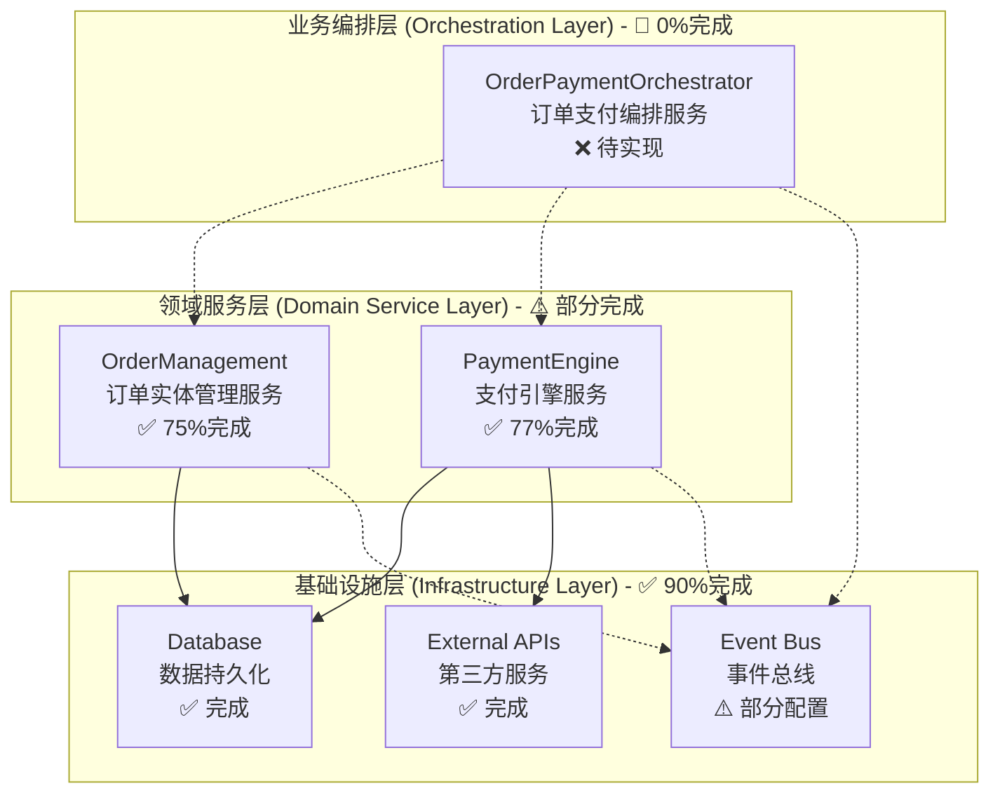

# TCM 处方平台开发规范 v2.0 - DDD架构版

**文档版本：** 2.0 - **领域驱动设计（DDD）架构版**  
**创建日期：** 2025年6月13日  
**更新日期：** 2025年6月19日 (重大架构状态更新)  
**基于版本：** SOPv1.3 + downsizedSOPv1.5 + Development Tracker v2.0  
**项目：** 新西兰中医药电子处方平台 MVP 1.0  
**核心架构：** 领域驱动设计 + 事件驱动架构 + 接口隔离原则  
**技术栈：** NestJS + Prisma + TypeScript + Supabase PostgreSQL + Stripe  

---

## 📋 文档变更摘要

### v2.1 重大状态更新 (2025年6月19日)
- 🔍 **基于代码库深度分析**：重新评估Task 5A/B/C真实完成状态
- ⚠️ **风险重新评级**：Task 5C业务编排层缺失提升为P0级关键风险
- 📊 **架构完整性评估**：识别DDD三层架构中的关键缺失环节
- 🎯 **技术债务量化**：明确各Task剩余工作量和实施复杂度

### v2.0 重大架构变更 (2025年6月13日)
- ✅ **引入DDD理念**：按业务领域而非技术层次划分服务
- ✅ **Task 5重构**：拆分为三层架构（订单实体、支付引擎、业务编排）
- ✅ **推迟功能管理**：建立系统性的功能推迟追踪机制
- ✅ **时间线调整**：Phase 1从4周扩展到6-8周
- ✅ **风险强化**：新增DDD架构相关的P0级风险管控

---

## 🎯 1. 项目概述与 MVP 1.0 目标

### 1.1 项目愿景
为新西兰中医师提供一个高效、便捷、合规的电子处方和草药调配协作平台，通过**领域驱动设计**确保系统的可维护性和可扩展性，降低运营成本和复杂度，提升患者服务体验。

### 1.2 MVP 1.0 核心功能范围（DDD架构版）

#### 核心业务闭环
1. **医生开方**：医生使用平台搜索药品、创建电子处方
2. **诊所账户支付**：通过**支付引擎服务**从诊所预付账户实时扣除订单成本
3. **凭证生成与交付**：**订单实体管理服务**生成包含唯一订单号和QR码的电子凭证
4. **药房扫码与验证**：药房通过**业务编排服务**验证订单真实性
5. **药房履约**：药房完成配药，通过**订单实体管理服务**提交履约凭证
6. **管理员审核**：平台管理员通过**业务编排服务**审核履约凭证
7. **平台结算**：**支付引擎服务**自动生成与药房的结算记录

#### DDD架构核心优势
- **职责清晰**：每个领域服务专注于特定业务逻辑
- **接口隔离**：服务间通过明确定义的接口通信
- **事件驱动**：通过事件解耦服务间的复杂依赖
- **测试友好**：每个服务可独立开发和测试

### 1.3 架构完整性现状评估 (基于代码库分析)

#### ✅ 已完成基础设施 (90%+)
- **数据模型层**：Prisma Schema完整定义，支持DDD实体关系
- **认证授权系统**：JWT + RBAC权限控制完整实现
- **药品信息服务**：数据管理和搜索功能完整可用
- **支付基础设施**：Stripe集成和Webhook处理机制就绪

#### ⚠️ 部分完成核心服务
- **Task 5A (订单实体管理)**：75%完成，业务逻辑层完整，API层缺失
- **Task 5B (支付引擎服务)**：77%完成，主要功能就绪，3个核心方法待实现
- **Task 5C (业务编排服务)**：0%完成，整个应用服务层缺失

#### 🚨 关键架构风险识别
- **P0级风险**：业务编排层完全缺失，违背DDD三层架构设计原则
- **P1级风险**：服务间事件驱动通信机制尚未建立
- **P2级风险**：分布式事务和数据一致性保证机制不完整

---

## 🏗️ 2. DDD架构设计原则与技术标准

### 2.1 领域驱动设计核心理念

#### 领域划分原则
- **订单领域（Order Domain）**：订单实体、状态管理、业务规则
- **支付领域（Payment Domain）**：支付引擎、账户管理、资金流转  
- **编排领域（Orchestration Domain）**：业务流程、事件协调、状态同步

#### 设计原则
1. **单一职责原则**：每个服务只负责一个业务领域
2. **接口隔离原则**：服务只暴露必要的业务接口
3. **依赖倒置原则**：高层模块依赖抽象接口，而非具体实现
4. **事件驱动架构**：通过领域事件解耦服务间通信

### 2.2 三层架构设计与实现状态

### 2.3 技术标准与质量门禁

#### 代码质量标准
- **TypeScript严格模式**：启用所有类型检查，禁止any类型
- **测试覆盖率要求**：核心业务逻辑≥95%，支付相关功能100%
- **代码复杂度控制**：圈复杂度≤10，函数长度≤50行
- **文档完整性**：所有公共接口必须有JSDoc注释

#### 安全规范
- **支付安全**：PCI DSS合规，敏感数据加密传输和存储
- **权限控制**：RBAC细粒度权限，操作审计日志
- **数据完整性**：事务原子性，乐观锁并发控制
- **API安全**：签名验证，速率限制，输入验证

#### 性能基准
- **响应时间**：P95≤200ms，P99≤500ms
- **并发能力**：支持1000+并发操作无数据不一致
- **系统可用性**：≥99.9%，故障恢复时间≤5分钟
- **数据一致性**：分布式环境下强一致性保证

---

## 🚨 3. 关键风险评估与管控策略 (更新版)

### 3.1 P0级别风险（阻塞发布）

#### 🔴 业务编排层缺失风险 ⭐ **新识别P0关键风险**
- **风险描述**：Task 5C业务编排服务完全未实现，违背DDD三层架构设计
- **影响评估**：
  - 支付成功后订单状态无法自动更新
  - 支付失败时缺少自动回滚机制
  - 业务流程依赖手动协调，无法自动化运行
  - 系统架构不完整，无法支持复杂业务规则
- **缓解策略**：
  - **立即优先级提升**：将Task 5C设为P0最高优先级
  - **技术预研**：进行NestJS CQRS + Saga模式技术验证
  - **分阶段实施**：先实现基础事件监听，再完善复杂编排逻辑
  - **时间预算**：预留6-9.5天专门用于业务编排层实现

#### 🔴 Task 5C技术方案待确定风险 ⭐ **P0级技术风险**
- **风险描述**：业务编排层技术方案尚未确定，需要在Task 5A/B完成后深入研究
- **影响评估**：技术选型不当可能导致开发复杂度超预期，影响交付时间
- **缓解策略**：
  - **优先完成5A/B**：先完成基础服务层，为5C技术选型提供更好的基础
  - **技术调研**：在5A/B完成后进行深入的技术方案研究
  - **风险控制**：评估多种技术方案的优缺点和实施风险
  - **分阶段实施**：从最简单可行的方案开始，逐步完善

#### 🔴 服务集成数据一致性风险
- **风险描述**：三个子服务集成可能出现支付与订单状态不同步
- **影响评估**：可能导致资金损失或订单状态错误
- **缓解策略**：
  - **事务边界控制**：明确定义每个服务的事务范围
  - **事件溯源机制**：建立完整的事件历史追踪
  - **补偿机制**：实施分布式事务的回滚和补偿逻辑
  - **监控告警**：建立数据一致性实时监控

#### 🔴 并发控制安全风险
- **风险描述**：高并发下账户余额操作可能出现数据不一致
- **缓解策略**：数据库约束 + 乐观锁 + 压力测试验证
- **验收标准**：1000并发下无数据不一致，零资金损失

### 3.2 P1级别风险监控

#### 🟡 开发学习曲线风险
- **风险描述**：团队对DDD架构和事件驱动模式的学习成本
- **缓解策略**：提供DDD培训，建立最佳实践文档和代码模板

#### 🟡 接口变更影响风险
- **风险描述**：服务接口变更可能影响其他服务的集成
- **缓解策略**：实施接口版本控制，建立向后兼容机制

#### 🟡 技术债务累积风险
- **风险描述**：为了快速交付，可能累积技术债务影响长期维护
- **缓解策略**：建立技术债务追踪机制，定期重构和代码质量评审

---

## 📊 4. 推迟功能管理与技术债务评估

### 4.1 推迟功能分类管理

#### P0级推迟功能（MVP 2.0优先开发）
| 功能模块 | 原始优先级 | 推迟原因 | 预期开发时间 | 业务影响评估 |
|---------|-----------|---------|-------------|-------------|
| 处方模板管理系统 | P1 | 聚焦核心交易流程 | 2周 | 中等 - 影响医生效率 |
| 高级订单管理 | P1 | DDD架构重构优先 | 1周 | 低 - 基础功能已满足 |
| 用户报表系统核心 | P1 | 资源集中核心业务 | 3周 | 中等 - 影响运营分析 |

#### P1级推迟功能（MVP 2.0中期开发）
| 功能模块 | 原始优先级 | 推迟原因 | 预期开发时间 | 业务影响评估 |
|---------|-----------|---------|-------------|-------------|
| 医生推荐机制完整版 | P1 | 简化为基础逻辑 | 2周 | 低 - 基础逻辑已实现 |
| 药品高级搜索 | P1 | 基础搜索已满足需求 | 1周 | 低 - 用户体验优化 |
| 批量操作功能 | P2 | 单个操作已满足MVP | 1.5周 | 低 - 运营效率提升 |

#### P2级推迟功能（MVP 2.0后期开发）
| 功能模块 | 原始优先级 | 推迟原因 | 预期开发时间 | 业务影响评估 |
|---------|-----------|---------|-------------|-------------|
| AI智能审核系统 | P2 | 技术复杂度高 | 4周 | 低 - 人工审核可替代 |
| 高级管理后台 | P2 | 基础管理已满足 | 3周 | 低 - 运营便利性提升 |
| 复杂分类管理 | P2 | 基础分类已满足 | 1周 | 极低 - 数据管理优化 |

### 4.2 技术债务量化评估

#### 当前技术债务规模
- **推迟功能开发时间**：约18.5周
- **核心架构缺失**：Task 5C业务编排层（预估6-9.5天）
- **API层补全**：Task 5A OrderController（预估1-2天）
- **支付功能补全**：Task 5B核心方法（预估3-5天）

#### 债务管理优先级
1. **P0级债务**：业务编排层缺失 - 立即处理
2. **P1级债务**：API层补全 - 近期处理
3. **P2级债务**：功能增强 - 后续版本处理

---

## ⏱️ 5. 更新的开发时间线与里程碑 (基于真实进度)

### 5.1 剩余开发时间线重新规划

#### 当前状态总结 (2025年6月19日)
- **Phase 1基础设施**：✅ 100%完成
- **Task 4药品管理**：✅ 100%完成
- **Task 5A订单管理**：✅ 75%完成 (业务层完整，API层缺失)
- **Task 5B支付引擎**：✅ 77%完成 (主要功能就绪，3个方法待实现)
- **Task 5C业务编排**：❌ 0%完成 (完全未开始)

#### 紧急补全计划 (2-3周)

##### Week 1: 核心服务补全
- **Day 1-2: Task 5A补全** 
  - OrderController实现和模块集成
  - API端点测试和文档完善
  - 验收标准：订单CRUD API完全可用

- **Day 3-5: Task 5B补全**
  - confirmPayment方法实现
  - deductFromClinicAccount/refundToClinicAccount方法实现
  - 集成测试和压力测试
  - 验收标准：支付引擎100%功能完整

##### Week 2-3: 业务编排层设计与实现
- **Day 1-3: Task 5C技术方案研究**
  - 业务编排需求分析和架构设计
  - 多种技术方案评估和风险分析
  - 技术选型决策和实施计划制定

- **Day 4-10: Task 5C实现**
  - 业务编排服务框架搭建
  - 核心业务流程实现
  - 服务集成和数据一致性保证
  - 端到端集成测试

### 5.2 关键里程碑检查点 (重新制定)

#### 里程碑M1 (1周后) ⭐ **服务层补全完成**
- [ ] Task 5A: OrderController实现完成，API层100%可用
- [ ] Task 5B: 3个核心方法实现完成，支付引擎100%功能完整
- [ ] 服务层集成测试通过，为编排层实现奠定基础

#### 里程碑M2 (2周后) ⭐ **Task 5C技术方案确定**  
- [ ] Task 5C业务编排需求分析完成
- [ ] 技术方案评估和选型决策完成
- [ ] Task 5C详细实施计划制定完成

#### 里程碑M3 (3周后) ⭐ **DDD架构完成**
- [ ] Task 5C: 业务编排服务完整实现
- [ ] DDD三层架构验收测试通过
- [ ] 端到端业务流程自动化验证完成

#### 里程碑M4 (4周后) ⭐ **MVP生产就绪**
- [ ] 系统集成测试和性能优化完成
- [ ] 安全审计和合规性检查通过
- [ ] 生产环境部署和监控配置完成

---

## 🎯 6. 上线前检查清单（DDD架构版）

### 6.1 架构完整性验证
- [ ] **DDD三层架构完整**：订单实体、支付引擎、业务编排三层100%实现
- [ ] **服务边界清晰**：每个服务职责明确，无重叠或缺失
- [ ] **接口设计完整**：所有服务接口文档化，版本控制机制建立
- [ ] **事件驱动机制**：事件发布订阅机制正常工作，解耦效果验证

### 6.2 业务流程验证
- [ ] **端到端流程**：完整订单支付流程自动化验证通过
- [ ] **异常处理**：各种异常场景恢复机制验证完成
- [ ] **分布式事务**：Saga模式补偿机制验证通过
- [ ] **数据一致性**：分布式环境下强一致性保证验证

### 6.3 技术指标验证
- [ ] **性能基准**：P95≤200ms, P99≤500ms
- [ ] **并发能力**：1000+并发下业务流程稳定，无数据不一致
- [ ] **系统可用性**：≥99.9%，故障恢复时间≤5分钟
- [ ] **安全合规**：PCI DSS合规验证，权限控制和审计完整

### 6.4 监控与运维就绪
- [ ] **业务指标监控**：订单处理、支付成功率、系统性能监控覆盖
- [ ] **告警机制**：关键异常情况及时告警，故障响应流程建立
- [ ] **日志系统**：结构化日志，支持问题排查和审计追踪
- [ ] **备份恢复**：数据备份策略和灾难恢复方案验证

---

## 📝 文档更新日志

### 2025年6月19日 - v2.1 (重大状态更新版)

🔍 **基于代码库深度分析的状态修正**：
- 重新评估Task 5A/B/C真实完成状态（75%/77%/0%）
- 识别业务编排层缺失为P0级关键风险
- 更新开发时间线，基于实际进度重新规划

⚠️ **风险评估重大调整**：
- Task 5C Saga模式实现提升为P0级技术风险
- 新增业务编排层缺失为P0级架构风险
- 建立紧急补全计划和里程碑检查点

📊 **技术债务量化**：
- 明确各Task剩余工作量和复杂度
- 建立优先级管理和追踪机制
- 制定技术预研和实施策略

### 2025年6月13日 - v2.0 (DDD架构重设计版)

🎯 **重大架构变更**：
- 引入领域驱动设计（DDD）理念
- Task 5重构为三层架构（订单实体、支付引擎、业务编排）
- 建立推迟功能系统性管理机制

📊 **开发策略调整**：
- Phase 1扩展到6-8周，增加DDD架构实施时间
- 建立MVP 2.0功能规划预览
- 完善上线前检查清单，确保架构完整性

---

*最后更新：2025年6月19日*  
*文档类型：架构指导和技术规范*  
*下次更新：重大架构变更或技术标准调整时*  
*SOPv2.0 - 项目"宪法"，确保技术标准和架构完整性* 🏛️ 